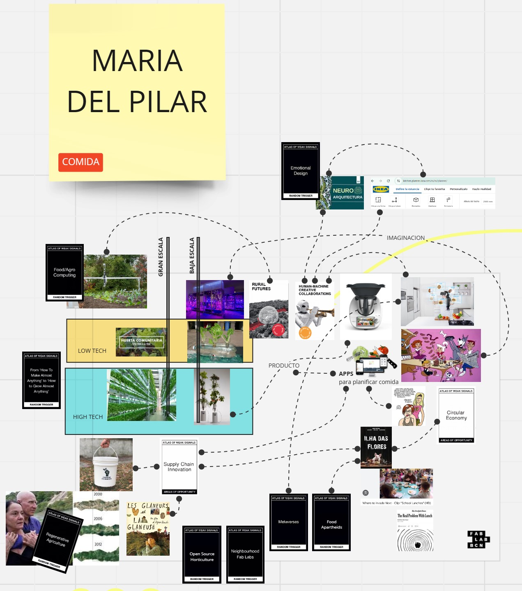
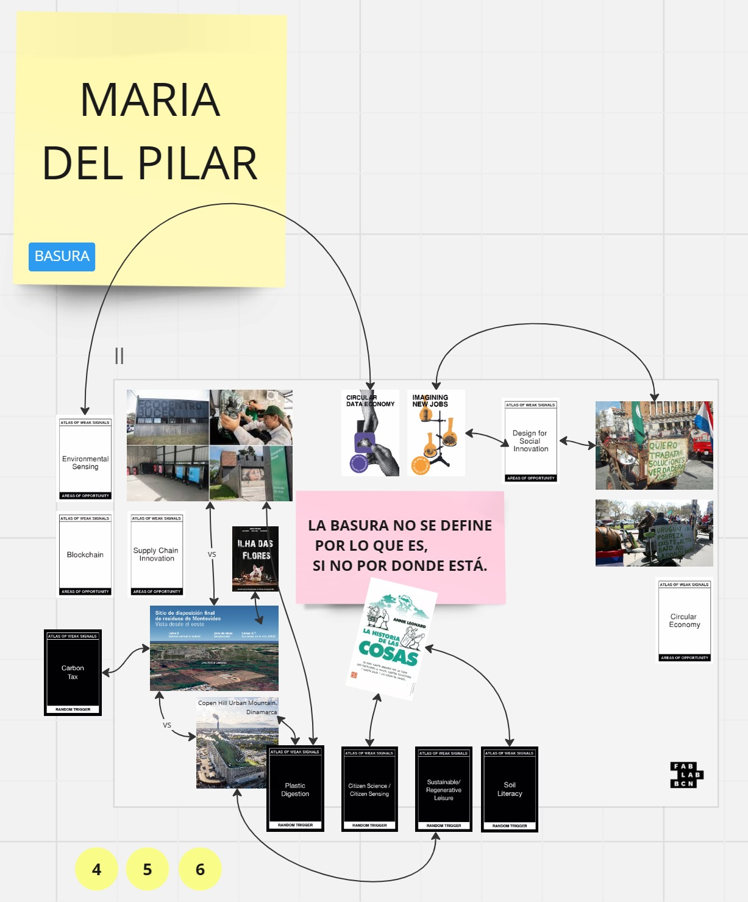
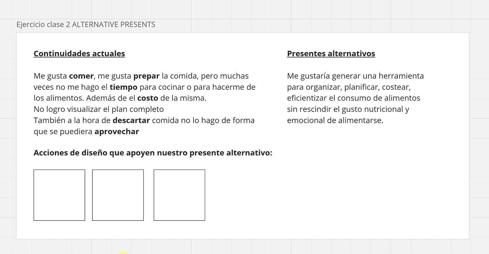
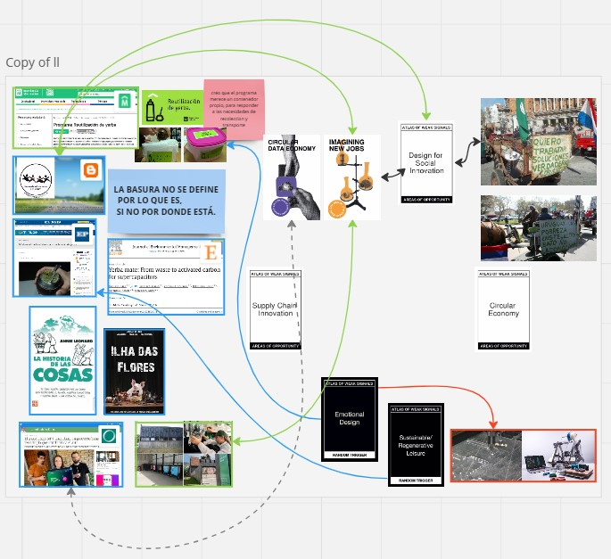
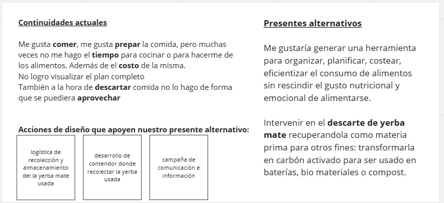
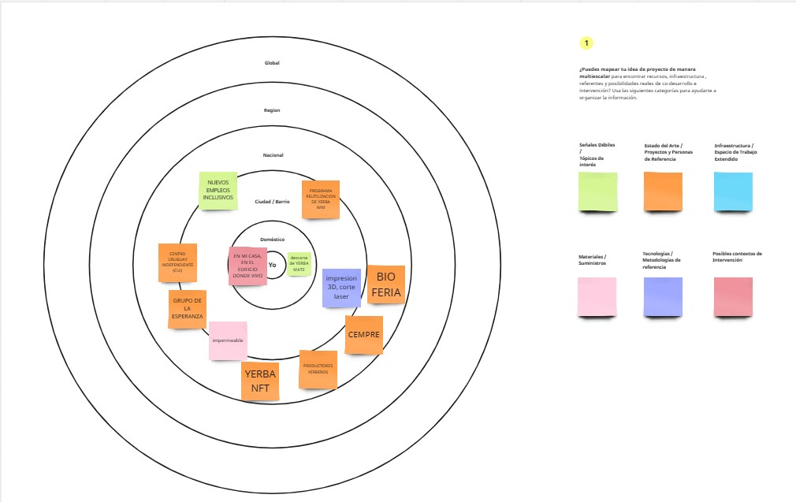

---
hide:
    - toc
---

# MD01

Hoy Jana nos presentó a los AoWS y los Espacios de Diseño. Otro desafío en formato de juego. A jugar se ha dicho, y hecho.

Me falta jerarquizar relaciones y categorizarlas. Estoy en plena etapa divergente.

Hoy en clase nos reunimos a intercambiar ideas. Ahora el objetivo es converger definiendo en pocas frases el presente actual sobre el que queremos intervenir y el Presente alternativo, producto de las acciones de diseño. WIP

Después de la clase del jueves 25 me llevé la tarea de converger, buscar un tema específico dentro del universo de comida-basura en el que estaba navegando. 
Dí entonces con una nota peridística que difundía el invento de Florencia Jerez de transformar yerba mate en carbón activado para ser usado en capacitores para baterías. Así hice un recorte en el alimento/material "Yerba Mate", siendo que Uruguay tiene un consumo anual de 10kg/habitante me parece que es un elemento que amerita ser relevado.

Aunque no estoy conforme con el resultado, en esto avancé:

