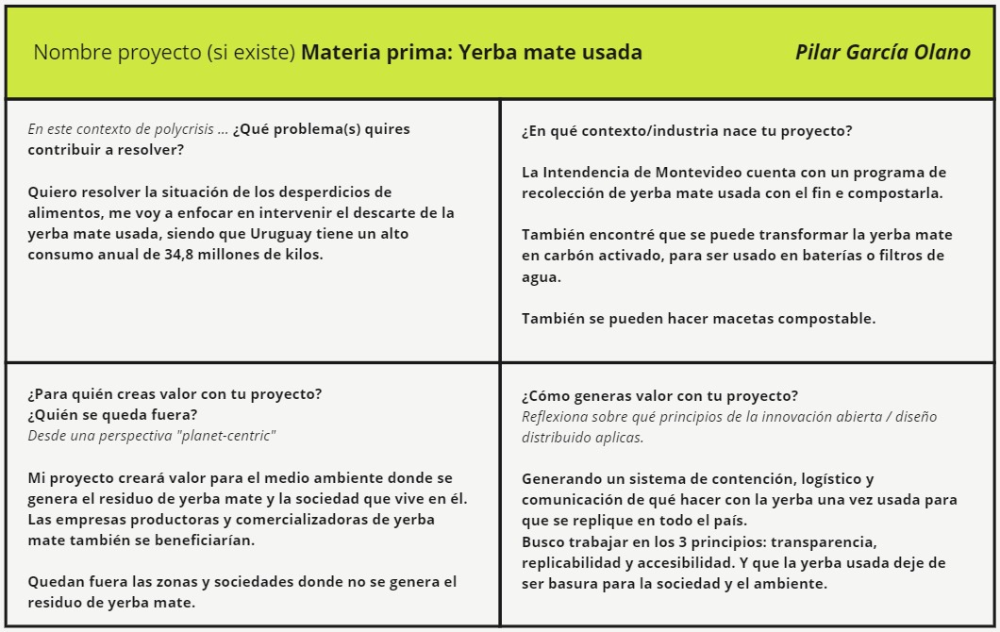
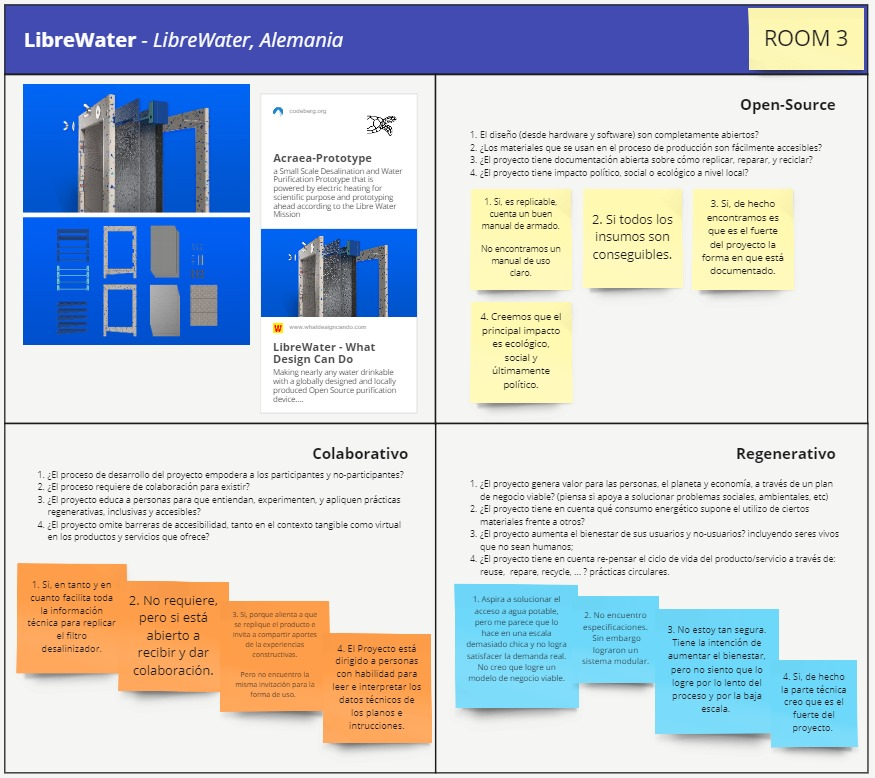

---
hide:
    - toc
---

# MI01

Tuve 2 clases con Paola Zanchetta quier nos compartió los principios de la Innovación Abierta y el Diseño Distribuido. Reflexionamos sobre la importancia del significado "Regenerativo" y que implicancia tiene en los proyectos.

En una primera instancia refleccioné individualmente en mi proyecto en proceso.
Estoy trabajando en el descarte y posterior uso de la Yerba mate usada, todavía no veo claro el objetivo. Se presentan varias alternativas que pretendo seguir investigando a fin de elegir un camino.

Esta semana estuve hablando con Florencia Jerez, ella es científica de Argentina, hace años trabaja en un proyecto en el cual transforman el residuo de la yerba usada en carbón activado para ser usado en supercapacitores o filtros medioambientales. Me resulta muy interesante su investigación, aunque aún no sé cómo podría aplicarla para mi proyecto EFDI 2024.

Comparto el cuadro hecho en clase:

También tuvimos una instancia de intercambio y reflexión grupal en base a un proyecto propuesto por Paola que era nuevo para quienes lo analizamos. En el siguiente cuadro comparto las conclusiones a las que llegamos con Edgardo y Francisco.

De estas jornadas Innovativas me llevo mucho para leer, y el desafío de darle una mirada holística al proyecto en el que estoy trabajando. Dejo asentado en este apartado qué aspectos me gustaría que no le falten al proyecto:
- Un clara descripción de la situación de uso.
- Planos técnicos prolijos y un claro manual de construcción.

