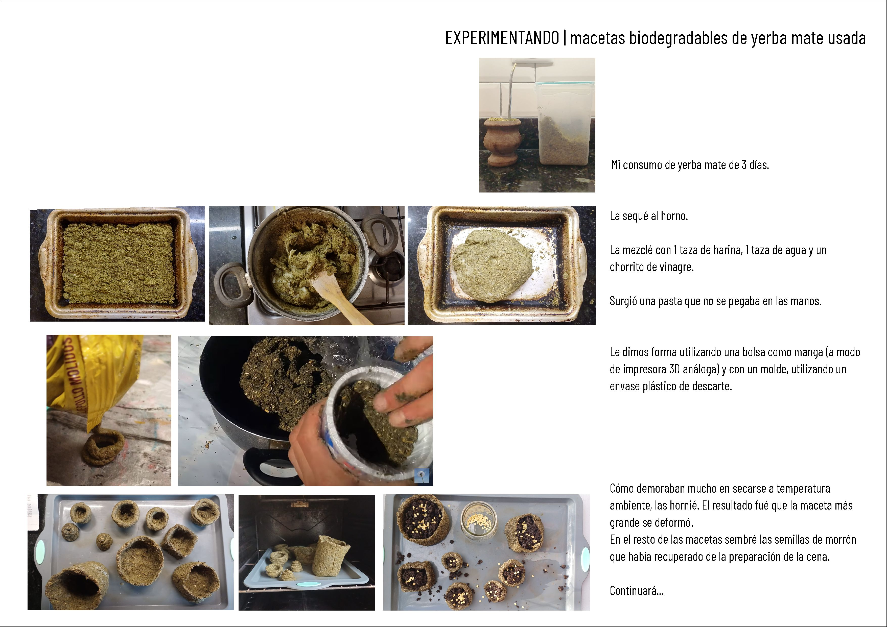
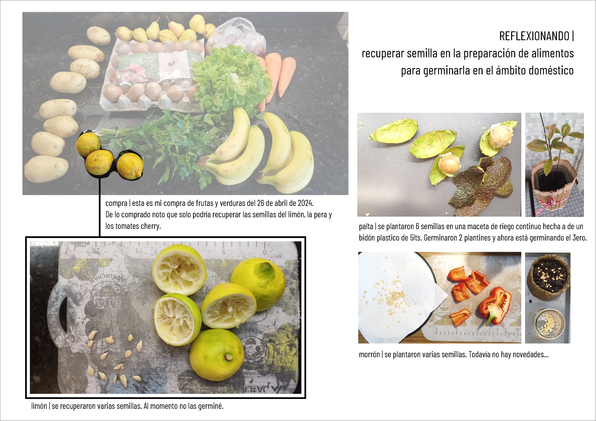

---
hide:
    - toc
---

# Ideas Iniciales

Mi proyecto surge del cruce y la relación acción reacción del acto de comer, preparar la comida y el "desperdicio" que se genera.

Con el fin de enfocar el universo comida-basura(?) elegí investigar sobre el consumo y descarte de la yerba mate, siendo que en uruguay se generan 35 millones de kilos de "basura".

Bajo el lema "la basura no se define por lo que es, si no por donde está", me propongo analizar el circuito de la yerba desde su origen, consumo y disposición a fin de encontrar una oportunidad (o varias) para ingresarla a un circuito circular.

Navegando por la red dí con una nota de unos investigadores argentinos que descubrieron que el residuo de la yerba mate se puede transformar en carbón activado para diversas aplicaciones, desde filtros a supercapitores (con mejores resultados que el carbón activado de origen vegetal que actualmente se encuentra en el mercado)
Logré conversar con Florencia Jerez, una de las científicas involucradas en la investigación. Vimos la posibilidad de desarrollar "cartuchos"- contenedores para el carbón activado para sus diferentes aplicaciones.
A mi me llamó la atención la capacidad del carbón activado de absorver el CO2 que se genera por la carbonización de la yerba y la posibilidad de "desorber" el gas para recuperarlo y darle utilidad.

También googleando encontré que se pueden hacer macetas con yerba descartada. Siguiendo las instrucciones de videos de you tube hice mi propia experiencia:

Imagen con secuencia

Video que imita a la posibilidad de una impresora 3D 
<video controls src="../images/20240523macetadeyerba.mp4" title="extrusora"></video>

También estuve reflexionando sobre la posibilidad de recuperar semillas de las frutas que son usados en la preparación de alimentos en el ámbito doméstico.

Continuará.