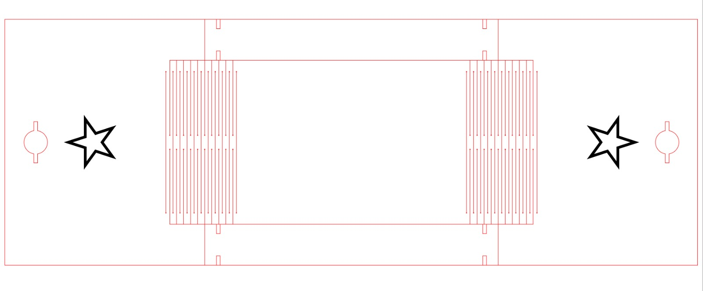
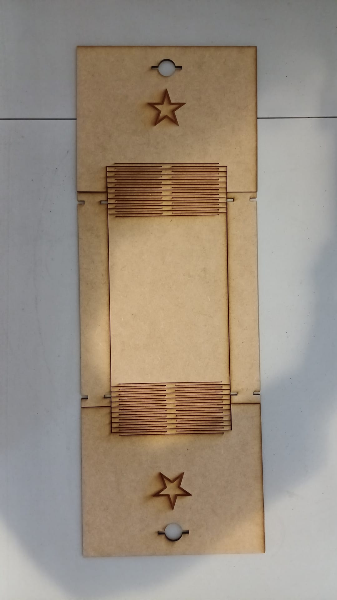
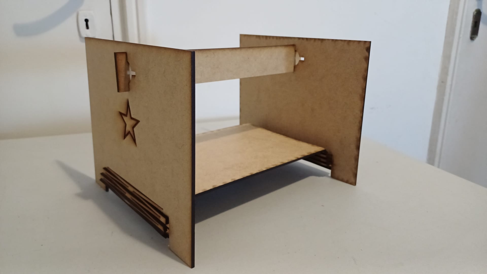
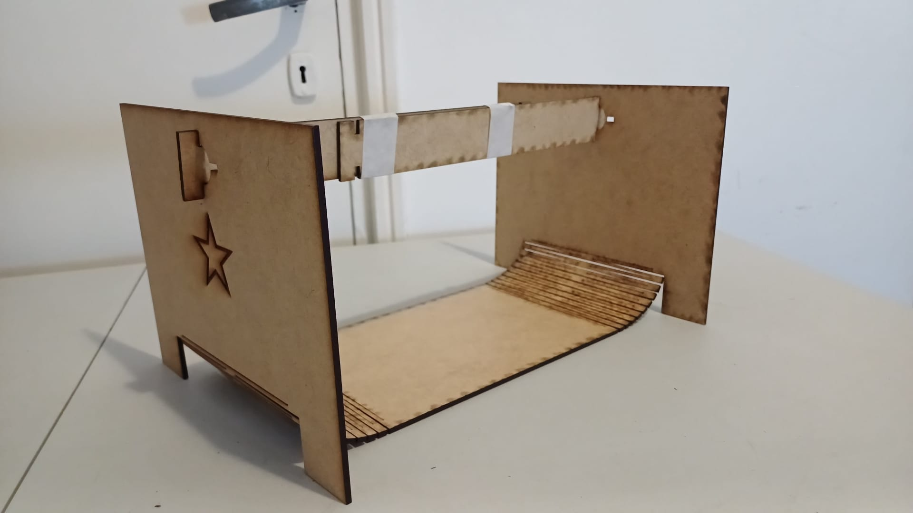

---
hide:
    - toc
---

# MT03

Corte laser

Prepare el archivo en corel draw.

No surgio como esperaba, por eso le hice un par de toques con la cinta.
Me propongo a seguir probando, usando nuevos programas de software más actualizados.
